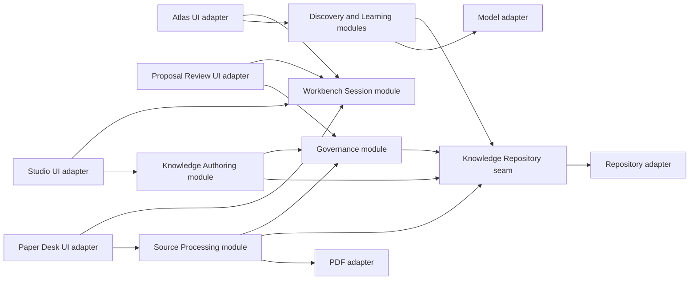
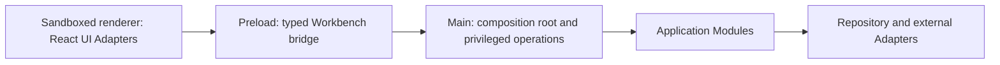

# V1 architecture

## Architectural aim

The architecture should make the human trust boundary deep: UI callers request meaningful knowledge operations through small interfaces, while provenance, version checks, autosave, proposal dependencies, recovery, and audit behavior remain local to the modules that own those rules.

The three workspaces are user-facing concepts, not three independent data silos. They are desktop UI adapters over shared application modules and the same repository state.

Arrows indicate interface use, not required process or package boundaries.

## Desktop process architecture

[ADR 0004](../../adr/0004-use-electron-typescript-for-v1.md) selects Electron and strict TypeScript. The Electron process model maps onto the architecture without becoming the domain design:

The renderer owns presentation and unprivileged interaction state. It receives only small operation-specific capabilities from preload. The main process owns the selected repository root, validates privileged requests, and composes framework-independent application Modules with production Adapters. Domain rules do not live in React views, preload, or IPC handlers.

The live correspondence between these responsibilities and source files belongs in the [code map](code-map.md), which is updated whenever production Modules or Adapters move.

## Deep modules and interfaces

### Workbench Session module

Its interface opens the Workbench, transitions to a workspace with context, and manages the bounded Working Set. Its implementation owns launch-versus-resume behavior, global and contextual navigation, back/forward history, active items, reading position, and UI-state autosave.

Callers do not manage route serialization, session persistence, or context reconstruction themselves. Deleting this module would force every workspace to reproduce those rules, so the module earns leverage and locality.

### Source Processing module

Its interface captures a Structured Annotation, reports source availability, relinks a Source Record, and requests Synthesis from selected annotations. Its implementation owns locator integrity, attribution, capture classification, incomplete-capture tracking, target suggestions, and the distinction between capture and Synthesis.

The interface returns domain outcomes—including “no knowledge change”—rather than directly modifying Governed Knowledge.

### Knowledge Authoring module

Its interface opens an authoring draft, applies user edits, and exposes equivalent rich and source representations. Its implementation owns the extended-Markdown round trip, structured-object editing, Working Material autosave, metadata validation, backlinks, and inspector projections.

Rendering and parsing mechanics stay behind the interface. Tests and callers should observe preserved meaning and repository text, not editor-engine nodes or parser internals.

### Governance module

Its interface drafts a Proposal, records Judgment on reviewable changes, and applies an eligible Proposal. Its implementation owns exact-version binding, evidence and epistemic requirements, dependency validation, stale-review detection, selective decisions, audit records, evolution requirements, and reversible version creation.

This is the primary trust module. UI adapters may explain or render its outcomes but may not duplicate or bypass its eligibility rules.

### Discovery module

Its interface accepts an explicit Search, Ask, or Jump intention and returns a mode-specific result. Its implementation owns index queries, cited Ask context, authority distinctions, conflicts, uncertainty, unsupported-answer outcomes, and command discovery.

Search, Ask, and Jump share an entry surface but not ambiguous execution semantics. A caller must always know which intention it is invoking.

### Learning module

Its interface records user-owned goals, suggests progress with evidence, and accepts a human confirmation or correction. Its implementation owns learning-stage semantics and the derivation of Atlas continuation cues. Activity volume alone cannot mutate progress.

## State ownership

| State class | Examples | Authority and persistence |
| --- | --- | --- |
| Governed Knowledge | reviewed topics, maps, registries, guidance, templates | Repository source of truth; changes only through eligible applied Proposals |
| Working Material | drafts, annotations, captures, draft Proposals | Continuously autosaved; attributed; not authoritative merely because it is saved |
| Session state | active workspace, Working Set, reading position, pane preferences | Restorable convenience state; must not redefine knowledge |
| Derived state | search index, Generated Relationships, actionable counts | Rebuildable projection; must link back to authoritative or working items |
| External source state | PDF availability and resolved local locator | Replaceable adapter state; Source Record and logical locators remain portable |

No UI adapter owns durable domain state. Atlas cards, Studio inspectors, and Paper Desk tabs are projections or interaction surfaces over module interfaces.

## System seams and adapters

Introduce an adapter only where behavior genuinely varies:

- **Knowledge Repository seam:** a production repository adapter and an in-memory adapter used by behavior tests justify the seam. It stores and retrieves both Working Material and versioned Governed Knowledge without exposing filesystem details to application modules.
- **PDF seam:** the chosen PDF engine is an external dependency. A deterministic fixture adapter supplies known pages, text, and locators in tests.
- **Model seam:** any model used for Ask answers, relationship suggestions, or progress suggestions is a true external dependency. Tests provide a narrow mock adapter with one operation-specific response shape per capability; there is no generic conditional “model” mock.
- **Time and identity seams:** clocks and identifier sources are injected where timestamps, staleness, or stable identities affect observable behavior.

Do not introduce interfaces around internal parsers, reducers, view models, or workspace helpers merely to mock them. Those remain implementation details exercised through the module that owns their behavior.

## Governing invariants

1. Saved Working Material is not accepted Governed Knowledge.
2. Capture does not imply Synthesis, and Synthesis does not imply application.
3. Judgment applies only to the exact Proposal and target versions reviewed.
4. No UI route can bypass Governance eligibility.
5. Rich and source editing preserve the same supported meaning.
6. Source identity and Source Locators survive source unavailability and relinking.
7. Derived Atlas content identifies its authority and links to the items from which it was derived.
8. Ask cannot claim support absent from the selected knowledge scope and cannot mutate knowledge.
9. Global and contextual workspace transitions preserve relevant context without merging workspace responsibilities.
10. Accessibility semantics belong to the public desktop interface, not a later visual-polish phase.

## Selected foundation and deferred technology

The selected foundation is Electron, React, strict TypeScript, Electron Forge with Webpack, npm, Vitest, WebdriverIO, ESLint, and Prettier. The rationale and version-sensitive evidence live in the [stack decision brief](stack-research.md).

The package still does not choose an editor engine, PDF engine, index, model provider, updater, state-management library, router, or native database. A choice is justified only when a Vertical Slice encounters behavior that cannot be implemented responsibly without it. When a choice is hard to reverse, surprising, and a genuine trade-off, record it in a new ADR before allowing it to spread across Module Interfaces.
