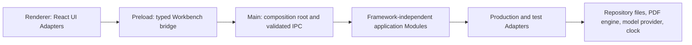

# V1 code map

Status: production implementation has not started. Planned homes below are orientation constraints, not links to files that do not yet exist.

This map tells agents where a Public Behavior enters the codebase, which Module owns it, which Adapter supplies external behavior, and which confirmed Test Seam observes it. Update it with live Markdown links in the same change that creates or moves code.

## Orient by behavior

1. Identify the current Tracer Bullet and confirmed Test Seam.
2. Find the owning Module below and enter through its public Interface.
3. Follow callers inward to the Implementation and outward to production and test Adapters.
4. Read the closest Behavior Test before changing the Interface.

Orientation is complete when the behavior's caller, owning Module, Adapter, and Test Seam are all accounted for. Search the repository when a listed pointer is stale; repair the map in the same change.

## Process and dependency direction

The renderer never imports main-process code or privileged Adapters. Preload exposes the bridge but owns no application rules. Application Modules import no Electron or React code. The main-process composition root chooses Adapters and wires Interfaces.

## Planned source roots

| Planned home | Responsibility | First expected use |
| --- | --- | --- |
| `app/src/main/` | Electron lifecycle, composition root, windows, validated IPC handlers | Tracer Bullet 1 |
| `app/src/preload/` | Typed operation-specific Workbench bridge | Tracer Bullet 1 |
| `app/src/renderer/` | Shell and workspace UI Adapters | Tracer Bullet 1 |
| `app/src/modules/<module>/` | Framework-independent application Module; public Interface at its entry file | As the owning behavior appears |
| `app/src/adapters/<seam>/` | Production, In-memory, fixture, or Mock Adapters at real Seams | As the Seam appears |
| `app/tests/workflows/` | S1 WebdriverIO desktop Behavior Tests | Tracer Bullet 1 |
| `app/tests/contracts/` | S5 shared Adapter contract tests | First production Adapter |
| `app/tests/fixtures/` | Small fixed inputs with Independent Expected Values | Tracer Bullet 1 |
| `app/templates/knowledge-repository/` | Empty public starter skeleton for new repositories | Tracer Bullet 1 |

## Application Modules

| Module | Public responsibility | Test Seam | Planned public entry | Status |
| --- | --- | --- | --- | --- |
| [Workbench Session](architecture.md#workbench-session-module) | Open, create, or resume the Workbench, transition with context, and maintain the Working Set | S1 | `app/src/modules/workbench-session/index.ts` | Unimplemented; first vertical path in Tracer Bullet 1 |
| [Knowledge Authoring](architecture.md#knowledge-authoring-module) | Author Working Material while preserving rich/source semantic equivalence | S1 initially | `app/src/modules/knowledge-authoring/index.ts` | Unimplemented; Tracer Bullet 11 |
| [Governance](architecture.md#governance-module) | Draft Proposals, record Judgment, and apply eligible exact-version changes through file transactions | S2 | `app/src/modules/governance/index.ts` | Unimplemented; Tracer Bullet 8 |
| [Source Processing](architecture.md#source-processing-module) | Add PDFs with a chosen Source Asset mode, capture located annotations, report availability, relink, and request Synthesis | S3 | `app/src/modules/source-processing/index.ts` | Unimplemented; Tracer Bullet 5 |
| [Discovery](architecture.md#discovery-module) | Execute explicit Search, Ask, or Jump intentions with authority-aware outcomes | S4 | `app/src/modules/discovery/index.ts` | Unimplemented; Tracer Bullet 12 |
| [Learning](architecture.md#learning-module) | Keep learning goals human-owned and explain progress suggestions | S1 initially | `app/src/modules/learning/index.ts` | Unimplemented; Tracer Bullet 14 |

## UI Adapters and desktop bridge

| Adapter | Responsibility | Planned home | Status |
| --- | --- | --- | --- |
| Workbench shell | Window-level layout, global mode controls, accessible navigation, and workspace composition | `app/src/renderer/workbench/` | Unimplemented; Tracer Bullet 1 |
| Atlas | Orientation, continuation, Judgment queue, Learning Routes, and actionable derived state | `app/src/renderer/atlas/` | Unimplemented; starts in Tracer Bullet 1 |
| Studio | Knowledge Authoring Interface and inspector presentation | `app/src/renderer/studio/` | Unimplemented |
| Paper Desk | Source Processing Interface and PDF interaction presentation | `app/src/renderer/paper-desk/` | Unimplemented |
| Proposal Review | Governance Interface and exact-diff Judgment presentation | `app/src/renderer/proposal-review/` | Unimplemented |
| Workbench bridge | Narrow renderer-to-main desktop operations exposed through `contextBridge` | `app/src/preload/workbench-bridge.ts` | Unimplemented; Tracer Bullet 1 |

## External Adapters

| Seam | Production Adapter | Test Adapter | Test Seam | Status |
| --- | --- | --- | --- | --- |
| Knowledge Repository | Root-scoped file-backed repository Adapter under `app/src/adapters/knowledge-repository/` | In-memory Adapter beside the Interface implementation | S5 contract; used by S1–S4 | Unimplemented; in-memory path begins in Tracer Bullet 1; file-backed path before V1 release |
| PDF | Deferred engine under `app/src/adapters/pdf/` | Deterministic fixture Adapter | S5 contract; used by S3 | Unimplemented; Tracer Bullet 5 |
| Model | Optional provider under `app/src/adapters/model/`; absent configuration is an explicit unavailable outcome | Narrow operation-specific Mock Adapters, including unavailable-provider behavior | Verified through S4, not an S5 equivalence contract | Unimplemented; Tracer Bullet 12 or later |
| Clock and identity | Platform clock and identifier sources under `app/src/adapters/system/` | Deterministic In-memory Adapters | Owning behavior's seam | Unimplemented until observable behavior requires them |

## Map maintenance

When code appears, replace each planned path with a relative Markdown link to the actual public entry. Add the closest production Adapter and Behavior Test without listing private helpers. Every production Module and Adapter must appear exactly once; generated files and framework boilerplate do not belong in this map.
