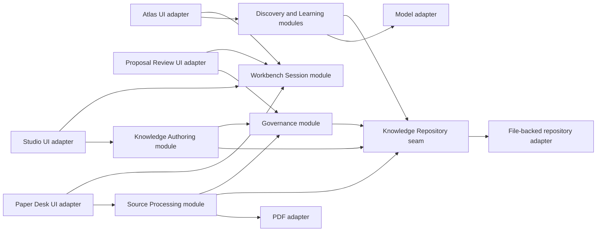

# V1 architecture

## Architectural aim

The architecture should make the human trust boundary deep: UI callers request meaningful knowledge operations through small interfaces, while provenance, version checks, autosave, proposal dependencies, recovery, and audit behavior remain local to the modules that own those rules.

The three workspaces are user-facing concepts, not three independent data silos. They are desktop UI adapters over shared application modules and the same repository state. That state conforms to the VCS-neutral [Repository Format](repository-format.md) and lives outside the installed Workbench.

Arrows indicate interface use, not required process or package boundaries.

## Desktop process architecture

[ADR 0004](../../adr/0004-use-electron-typescript-for-v1.md) selects Electron and strict TypeScript. The Electron process model maps onto the architecture without becoming the domain design:

The renderer owns presentation and unprivileged interaction state. It receives only small operation-specific capabilities from preload. The main process owns the selected repository root, validates privileged requests, and composes framework-independent application Modules with production Adapters. Domain rules do not live in React views, preload, or IPC handlers. The app does not invoke Git or Git LFS; the repository Adapter operates on validated files.

Agent Provider configuration is machine-local and optional. For V1, the provider Adapter targets the OpenAI API and reads `OPENAI_API_KEY` from the `.env` file described by the committed [`app/.env.example`](../../../app/.env.example). This is OpenAI API access, not ChatGPT consumer-account login or ChatGPT OAuth. Its absence is a normal capability state, not an application-startup failure: local repository and Workbench Modules remain available, while operations that require an Agent Provider return an explicit unavailable outcome. Provider credentials never enter the Repository Format, repository audit records, logs, or proposals. Support for other providers and model ecosystems, OS-backed credential storage, and provider-native OAuth remain future work.

Every OpenAI request has an explicit confirmation boundary owned by the relevant application Module before the Model Adapter is called, including requests containing only user-entered text. The confirmation presents a concise summary and an expandable exact-payload view: operation, OpenAI destination, model, prompt, selected repository-derived scope, metadata, and estimated request size. Users may remove whole context items before approval; the owning Module regenerates the summary and exact payload after each removal. Arbitrary inline redaction and payload editing are not V1 behavior. Small requests may expand the exact payload by default; large requests may collapse it only while keeping all content inspectable before approval. The confirmed payload is final; the Model Adapter may not add context afterward. No confirmation means no request; cancellation leaves local state unchanged. V1 has no blanket consent, remembered consent, silent background request, or whole-repository upload path. Confirmation policy is fixed for V1; configurable exemptions and remembered consent are future work.

The Model Adapter returns results transiently to the owning Module and must not persist request or response payloads. Automatic history, caches, logs, audit records, and support files contain no reconstructable OpenAI content. A user may explicitly save a result through the normal Working Material or Proposal workflow; that deliberate repository artifact is then governed by its ordinary lifecycle.

An explicitly saved OpenAI result is marked agent-generated and carries provider identity, pinned model version, generation timestamp, operation, and source-context references, including Source Records and Source Locators when applicable. The default save stores the result and this provenance only. A separate explicit save-with-prompt/context action may store the human-facing prompt, selected source references or locators, and concise context summaries; these are a point-in-time snapshot of the confirmed context and do not store full source excerpts. They may support navigation to the current source, but later source changes must not silently rewrite the saved artifact. When the Workbench detects that a referenced source's saved identity or content identity differs from the current source, it presents a non-blocking stale-context warning that distinguishes the saved snapshot from the current source; it does not silently refresh the snapshot or block access. Neither save path stores the hidden full API payload automatically. Human edits add authorship while preserving agent provenance. These fields describe origin and evidence; they do not make the result authoritative. The result remains Working Material until Governance accepts a Proposal.

The live correspondence between these responsibilities and source files belongs in the [code map](code-map.md), which is updated whenever production Modules or Adapters move.

## Deep modules and interfaces

### Workbench Session module

Its interface opens the Workbench, transitions to a workspace with context, and manages the bounded Working Set. Its implementation owns launch-versus-resume behavior, the explicitly selected repository root, global and contextual navigation, back/forward history, active items, reading position, and UI-state autosave. It may resume the last explicitly selected root after validating it; an unavailable or invalid root produces a user-choice recovery state rather than discovery.

Callers do not manage route serialization, session persistence, or context reconstruction themselves. Deleting this module would force every workspace to reproduce those rules, so the module earns leverage and locality.

### Source Processing module

Its interface adds a PDF with an explicit Source Asset mode, captures a Structured Annotation, reports source availability, relinks or changes the mode of a Source Record, and requests Synthesis from selected annotations. Its implementation owns Source Record creation, storage-choice validation, linked-file identity, locator integrity, attribution, capture classification, incomplete-capture tracking, target suggestions, and the distinction between adding a source, capture, and Synthesis.

The interface returns domain outcomes—including “no knowledge change” and `agent-provider-unavailable`—rather than directly modifying Governed Knowledge. Provider-independent capture, classification, linking, and review remain usable when agent-assisted Synthesis is unavailable.

### Knowledge Authoring module

Its interface opens an authoring draft—including a draft based on an existing Governed Knowledge version—applies user edits, and exposes equivalent rich and source representations. Its implementation owns the extended-Markdown round trip, structured-object editing, Working Material autosave, metadata validation, backlinks, and inspector projections. Editing a governed item never mutates its current version directly.

Rendering and parsing mechanics stay behind the interface. Tests and callers should observe preserved meaning and repository text, not editor-engine nodes or parser internals.

### Governance module

Its interface drafts a Proposal—manually or with optional agent assistance—from Working Material, records Judgment on reviewable changes, and applies an eligible Proposal. Its implementation owns exact-version binding, evidence and epistemic requirements, dependency validation, stale-review detection, selective decisions, immutable repository-held audit records, targeted rollback history, filesystem transaction recovery, external-edit detection, evolution requirements, and reversible version creation. It never delegates authority to Git commit status or Agent Provider availability. An applied Proposal creates a new governed version; it does not make Governed Knowledge permanently immutable.

This is the primary trust module. UI adapters may explain or render its outcomes but may not duplicate or bypass its eligibility rules.

### Discovery module

Its interface accepts an explicit Search, Ask, or Jump intention and returns a mode-specific result. Its implementation owns index queries, cited Ask context, authority distinctions, conflicts, uncertainty, unsupported-answer and `agent-provider-unavailable` outcomes, and command discovery. Search and Jump remain available without an Agent Provider.

Search, Ask, and Jump share an entry surface but not ambiguous execution semantics. A caller must always know which intention it is invoking.

### Learning module

Its interface records user-owned goals, suggests progress with evidence, and accepts a human confirmation or correction. Its implementation owns learning-stage semantics and the derivation of Atlas continuation cues. Activity volume alone cannot mutate progress.

## State ownership

| State class | Examples | Authority and persistence |
| --- | --- | --- |
| Governed Knowledge | reviewed topics, maps, registries, guidance, templates | Current repository source of truth; editable through eligible applied Proposals and recoverable file transactions, with prior versions retrievable |
| Working Material | drafts, annotations, captures, draft Proposals | Continuously autosaved; attributed; neither saving nor external Git status makes it authoritative |
| Session state | last explicitly selected repository root, active workspace, Working Set, reading position, pane preferences | Machine-local restorable convenience state; must not redefine knowledge or discover a different repository |
| Derived state | search index, Generated Relationships, actionable counts | Rebuildable projection outside the Repository Format; must link back to authoritative or working items |
| External source state | PDF availability and resolved local locator | Replaceable adapter state; Source Record and logical locators remain portable |

No UI adapter owns durable domain state. Atlas cards, Studio inspectors, and Paper Desk tabs are projections or interaction surfaces over module interfaces.

## System seams and adapters

Introduce an adapter only where behavior genuinely varies:

- **Knowledge Repository seam:** a production file-backed repository Adapter and an in-memory Adapter used by behavior tests justify the seam. It stores and retrieves Working Material, Governed Knowledge, audit records, and rollback data without exposing filesystem details to application modules. Git is optional external tooling, not an application dependency.
- **PDF seam:** the chosen PDF engine is an external dependency. A deterministic fixture adapter supplies known pages, text, and locators in tests.
- **Model seam:** any model used for Ask answers, agent-assisted Synthesis, relationship suggestions, or progress suggestions is a true external dependency. Its configuration is optional and machine-local. Tests provide a narrow mock adapter with one operation-specific response shape per capability, including an unavailable-provider outcome; there is no generic conditional “model” mock.
- **Time and identity seams:** clocks and identifier sources are injected where timestamps, staleness, or stable identities affect observable behavior.

Do not introduce interfaces around internal parsers, reducers, view models, or workspace helpers merely to mock them. Those remain implementation details exercised through the module that owns their behavior.

## Governing invariants

1. Saved Working Material is not accepted Governed Knowledge.
2. Capture does not imply Synthesis, and Synthesis does not imply application.
3. Judgment applies only to the exact Proposal and target versions reviewed.
4. No UI route can bypass Governance eligibility.
5. Governed Knowledge is authoritative but not immutable; its replacement is a new reviewed version and the prior version remains retrievable.
6. Rich and source editing preserve the same supported meaning.
7. Source identity and Source Locators survive source unavailability and relinking.
8. Derived Atlas content identifies its authority and links to the items from which it was derived.
9. Ask cannot claim support absent from the selected knowledge scope and cannot mutate knowledge.
10. Global and contextual workspace transitions preserve relevant context without merging workspace responsibilities.
11. Accessibility semantics belong to the public desktop interface, not a later visual-polish phase.
12. Galaxy Brain never requires or invokes Git, Git LFS, GitHub, credentials, or network connectivity for local use.
13. Applying a Proposal never overwrites external edits, leaves a partial transaction silently, or claims external backup.
14. A linked Source Asset whose bytes change is not silently treated as the same source.
15. Missing Agent Provider configuration never prevents local Workbench use; Agentic Capabilities report their unavailable state without mutating local knowledge.
16. No OpenAI request occurs without explicit confirmation for that operation and its visible request context.

17. A saved context snapshot whose current source cannot be checked or lacks a comparable identity shows `source status unavailable`, remains accessible and unchanged, and is not presented as current.
18. An explicit refresh of a saved context snapshot creates a new snapshot/version and preserves the original; it never silently replaces the historical context in place.
19. Refreshing a snapshot does not regenerate its agent result; regeneration is a separate explicit action and any new OpenAI request requires fresh confirmation.
20. Explicit result regeneration creates a new result version and preserves the previous result; it never silently overwrites earlier agent output.
21. The Workbench presents one current result while keeping prior result versions retrievable through ordinary artifact history rather than separate top-level items.
22. Explicitly restoring an older result creates a new current version, preserves all intervening versions, and does not invoke the Model Adapter.
23. Prior agent-result versions are retained by default; deletion or history pruning requires explicit approval and must explain the lost recovery and provenance.

## Selected foundation and deferred technology

The selected foundation is Electron, React, strict TypeScript, Electron Forge with Webpack, npm, Vitest, WebdriverIO, ESLint, and Prettier. The rationale and version-sensitive evidence live in the [stack decision brief](stack-research.md).

The package still does not choose an editor engine, PDF engine, index, updater, state-management library, router, or native database. OpenAI is the selected V1 Agent Provider. Each V1 Agentic Capability uses one internally selected, pinned OpenAI model version; the exact model and API surface are finalized by the Agentic Capability slice. The V1 Interface does not expose dynamic model discovery or user-facing model selection. Agent Provider configuration and credentials remain optional runtime capabilities rather than package prerequisites. The Agentic Capabilities are optional V1 behavior; deferring other providers, model ecosystems, and dynamic model selection does not remove the intended Interface or graceful-unavailable behavior. A choice is justified only when a Vertical Slice encounters behavior that cannot be implemented responsibly without it. When a choice is hard to reverse, surprising, and a genuine trade-off, record it in a new ADR before allowing it to spread across Module Interfaces.
