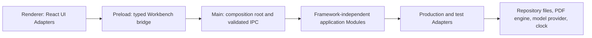

# V1 code map

Status: Tracer Bullets 1 through 7 and TB6.1–TB6.3 are complete and accepted. TB8, TB9, TB10, and TB11 implementation, compatible verification, and recorded human acceptance are complete for their recorded scopes on this branch. TB15 S3 implementation and human acceptance are complete, and the provider-free linked-PDF packaged gate is implemented, verified, and human-accepted for its recorded scope. See the TB8–TB10 reconciliation, TB11/TB15 records, and release-gate record in the delivery plan for release impact and explicit deferrals. Later tracer bullets remain unimplemented.

This map tells agents where a Public Behavior enters the codebase, which Module owns it, which Adapter supplies external behavior, and which confirmed Test Seam observes it. Update it with live Markdown links in the same change that creates or moves code.

Before implementation begins for any Tracer Bullet, review the governing documentation and applicable ADRs, create or update its guidance-compliant tracer-bullet spec, and confirm the behavior, Test Seam, independently known expected values, vertical path, boundaries, and acceptance evidence. The code map is implementation orientation after that prerequisite, not a substitute for the spec.

## Orient by behavior

1. Identify the current Tracer Bullet and confirmed Test Seam.
2. Find the owning Module below and enter through its public Interface.
3. Follow callers inward to the Implementation and outward to production and test Adapters.
4. Read the closest Behavior Test before changing the Interface.

Orientation is complete when the behavior's caller, owning Module, Adapter, and Test Seam are all accounted for. Search the repository when a listed pointer is stale; repair the map in the same change.

## Process and dependency direction

The renderer never imports main-process code or privileged Adapters. Preload exposes the bridge but owns no application rules. Application Modules import no Electron or React code. The main-process composition root chooses Adapters and wires Interfaces.

## Planned source roots

| Planned home                                                                          | Responsibility                                                                                                   | First expected use                                                                                                                                                                                                                                                                                                                                                                                                                                                                                                                                                                                                                                                                                                                                                                                                                                                                                                                                                                                                                                                                                                                                                                                                                                                                                                                                                                                                                                                                                                                                                                                                                                                                                                                                                                                                                                                                                                                                                                                                                                                                                                                                                                                                                                                                                                                                                                                                                                                                                                                                                                                                |
| ------------------------------------------------------------------------------------- | ---------------------------------------------------------------------------------------------------------------- | ----------------------------------------------------------------------------------------------------------------------------------------------------------------------------------------------------------------------------------------------------------------------------------------------------------------------------------------------------------------------------------------------------------------------------------------------------------------------------------------------------------------------------------------------------------------------------------------------------------------------------------------------------------------------------------------------------------------------------------------------------------------------------------------------------------------------------------------------------------------------------------------------------------------------------------------------------------------------------------------------------------------------------------------------------------------------------------------------------------------------------------------------------------------------------------------------------------------------------------------------------------------------------------------------------------------------------------------------------------------------------------------------------------------------------------------------------------------------------------------------------------------------------------------------------------------------------------------------------------------------------------------------------------------------------------------------------------------------------------------------------------------------------------------------------------------------------------------------------------------------------------------------------------------------------------------------------------------------------------------------------------------------------------------------------------------------------------------------------------------------------------------------------------------------------------------------------------------------------------------------------------------------------------------------------------------------------------------------------------------------------------------------------------------------------------------------------------------------------------------------------------------------------------------------------------------------------------------------------------------- |
| [`app/src/main/`](../../../app/src/main/)                                             | Electron lifecycle, composition root, windows, validated IPC handlers                                            | Tracer Bullet 1                                                                                                                                                                                                                                                                                                                                                                                                                                                                                                                                                                                                                                                                                                                                                                                                                                                                                                                                                                                                                                                                                                                                                                                                                                                                                                                                                                                                                                                                                                                                                                                                                                                                                                                                                                                                                                                                                                                                                                                                                                                                                                                                                                                                                                                                                                                                                                                                                                                                                                                                                                                                   |
| [`app/src/preload/`](../../../app/src/preload/)                                       | Typed operation-specific Workbench bridge                                                                        | Tracer Bullet 1                                                                                                                                                                                                                                                                                                                                                                                                                                                                                                                                                                                                                                                                                                                                                                                                                                                                                                                                                                                                                                                                                                                                                                                                                                                                                                                                                                                                                                                                                                                                                                                                                                                                                                                                                                                                                                                                                                                                                                                                                                                                                                                                                                                                                                                                                                                                                                                                                                                                                                                                                                                                   |
| [`app/src/renderer/`](../../../app/src/renderer/)                                     | Shell and workspace UI Adapters                                                                                  | Tracer Bullet 1                                                                                                                                                                                                                                                                                                                                                                                                                                                                                                                                                                                                                                                                                                                                                                                                                                                                                                                                                                                                                                                                                                                                                                                                                                                                                                                                                                                                                                                                                                                                                                                                                                                                                                                                                                                                                                                                                                                                                                                                                                                                                                                                                                                                                                                                                                                                                                                                                                                                                                                                                                                                   |
| `app/src/modules/<module>/`                                                           | Framework-independent application Module; public Interface at its entry file                                     | As the owning behavior appears                                                                                                                                                                                                                                                                                                                                                                                                                                                                                                                                                                                                                                                                                                                                                                                                                                                                                                                                                                                                                                                                                                                                                                                                                                                                                                                                                                                                                                                                                                                                                                                                                                                                                                                                                                                                                                                                                                                                                                                                                                                                                                                                                                                                                                                                                                                                                                                                                                                                                                                                                                                    |
| `app/src/adapters/<seam>/`                                                            | Production, In-memory, fixture, or Mock Adapters at real Seams                                                   | As the Seam appears                                                                                                                                                                                                                                                                                                                                                                                                                                                                                                                                                                                                                                                                                                                                                                                                                                                                                                                                                                                                                                                                                                                                                                                                                                                                                                                                                                                                                                                                                                                                                                                                                                                                                                                                                                                                                                                                                                                                                                                                                                                                                                                                                                                                                                                                                                                                                                                                                                                                                                                                                                                               |
| [`app/tests/workflows/`](../../../app/tests/workflows/)                               | S1 WebdriverIO desktop Behavior Tests                                                                            | [`app/tests/workflows/open-empty-workbench.e2e.ts`](../../../app/tests/workflows/open-empty-workbench.e2e.ts), [`app/tests/workflows/create-knowledge-repository.e2e.ts`](../../../app/tests/workflows/create-knowledge-repository.e2e.ts), [`app/tests/workflows/create-knowledge-repository-in-empty-directory.e2e.ts`](../../../app/tests/workflows/create-knowledge-repository-in-empty-directory.e2e.ts), [`app/tests/workflows/open-valid-knowledge-repository.e2e.ts`](../../../app/tests/workflows/open-valid-knowledge-repository.e2e.ts), [`app/tests/workflows/reject-invalid-knowledge-repository.e2e.ts`](../../../app/tests/workflows/reject-invalid-knowledge-repository.e2e.ts), [`app/tests/workflows/cancel-knowledge-repository-selection.e2e.ts`](../../../app/tests/workflows/cancel-knowledge-repository-selection.e2e.ts), [`app/tests/workflows/preserve-selection-after-failed-replacement.e2e.ts`](../../../app/tests/workflows/preserve-selection-after-failed-replacement.e2e.ts), [`app/tests/workflows/reject-unavailable-knowledge-repository.e2e.ts`](../../../app/tests/workflows/reject-unavailable-knowledge-repository.e2e.ts), [`app/tests/workflows/reject-unsafe-knowledge-repository.e2e.ts`](../../../app/tests/workflows/reject-unsafe-knowledge-repository.e2e.ts), [`app/tests/workflows/reject-unsupported-knowledge-repository.e2e.ts`](../../../app/tests/workflows/reject-unsupported-knowledge-repository.e2e.ts), [`app/tests/workflows/open-newer-knowledge-repository-read-only.e2e.ts`](../../../app/tests/workflows/open-newer-knowledge-repository-read-only.e2e.ts), [`app/tests/workflows/carry-context-between-workspaces.e2e.ts`](../../../app/tests/workflows/carry-context-between-workspaces.e2e.ts), [`app/tests/workflows/reopen-captured-source.e2e.ts`](../../../app/tests/workflows/reopen-captured-source.e2e.ts), [`app/tests/workflows/promote-atlas-view.e2e.ts`](../../../app/tests/workflows/promote-atlas-view.e2e.ts), [`app/tests/workflows/promote-studio-view.e2e.ts`](../../../app/tests/workflows/promote-studio-view.e2e.ts), [`app/tests/workflows/promote-paper-desk-view.e2e.ts`](../../../app/tests/workflows/promote-paper-desk-view.e2e.ts), [`app/tests/workflows/review-synthesis-confirmation.e2e.ts`](../../../app/tests/workflows/review-synthesis-confirmation.e2e.ts), [`app/tests/workflows/select-explicit-workbench-context.e2e.ts`](../../../app/tests/workflows/select-explicit-workbench-context.e2e.ts), [`app/tests/workflows/review-proposal.e2e.ts`](../../../app/tests/workflows/review-proposal.e2e.ts) |
| [`app/tests/contracts/`](../../../app/tests/contracts/)                               | S5 shared Adapter and Module contract tests                                                                      | [`app/tests/contracts/knowledge-repository.test.ts`](../../../app/tests/contracts/knowledge-repository.test.ts), [`app/tests/contracts/governance-version-store.test.ts`](../../../app/tests/contracts/governance-version-store.test.ts), [`app/tests/contracts/source-processing.test.ts`](../../../app/tests/contracts/source-processing.test.ts), [`app/tests/contracts/synthesis-result-repository.test.ts`](../../../app/tests/contracts/synthesis-result-repository.test.ts), [`app/tests/contracts/workbench-session-state.test.ts`](../../../app/tests/contracts/workbench-session-state.test.ts)                                                                                                                                                                                                                                                                                                                                                                                                                                                                                                                                                                                                                                                                                                                                                                                                                                                                                                                                                                                                                                                                                                                                                                                                                                                                                                                                                                                                                                                                                                                                                                                                                                                                                                                                                                                                                                                                                                                                                                                                         |
| [`app/tests/governance/`](../../../app/tests/governance/)                             | S2 Governance behavior tests                                                                                     | [`app/tests/governance/apply-governed-change.test.ts`](../../../app/tests/governance/apply-governed-change.test.ts), [`app/tests/governance/reject-stale-judgment.test.ts`](../../../app/tests/governance/reject-stale-judgment.test.ts), [`app/tests/governance/reject-invalid-dependency-subset.test.ts`](../../../app/tests/governance/reject-invalid-dependency-subset.test.ts), [`app/tests/governance/apply-independent-change-decisions.test.ts`](../../../app/tests/governance/apply-independent-change-decisions.test.ts), [`app/tests/governance/apply-deferred-change-decision.test.ts`](../../../app/tests/governance/apply-deferred-change-decision.test.ts), [`app/tests/governance/apply-edited-change-decision.test.ts`](../../../app/tests/governance/apply-edited-change-decision.test.ts), [`app/tests/governance/apply-edited-dependent-change-decision.test.ts`](../../../app/tests/governance/apply-edited-dependent-change-decision.test.ts)                                                                                                                                                                                                                                                                                                                                                                                                                                                                                                                                                                                                                                                                                                                                                                                                                                                                                                                                                                                                                                                                                                                                                                                                                                                                                                                                                                                                                                                                                                                                                                                                                                               | TB8 and TB9 S2/S5 Governance behavior is implemented, tested, and merged; TB10 uses the same public Governance Interface |
| `app/tests/fixtures/`                                                                 | Small fixed inputs with Independent Expected Values                                                              | Tracer Bullet 1 and TB2 open/rejection workflows                                                                                                                                                                                                                                                                                                                                                                                                                                                                                                                                                                                                                                                                                                                                                                                                                                                                                                                                                                                                                                                                                                                                                                                                                                                                                                                                                                                                                                                                                                                                                                                                                                                                                                                                                                                                                                                                                                                                                                                                                                                                                                                                                                                                                                                                                                                                                                                                                                                                                                                                                                  |
| [`app/tools/changed-lines-coverage.ts`](../../../app/tools/changed-lines-coverage.ts) | Framework-independent LCOV/diff parsing, changed-line evaluation, and CI summary Module for the PR coverage gate | [`app/tests/changed-lines-coverage.test.ts`](../../../app/tests/changed-lines-coverage.test.ts)                                                                                                                                                                                                                                                                                                                                                                                                                                                                                                                                                                                                                                                                                                                                                                                                                                                                                                                                                                                                                                                                                                                                                                                                                                                                                                                                                                                                                                                                                                                                                                                                                                                                                                                                                                                                                                                                                                                                                                                                                                                                                                                                                                                                                                                                                                                                                                                                                                                                                                                   | Issue #78                                                                                                                |
| [`app/templates/knowledge-repository/`](../../../app/templates/knowledge-repository/) | Empty public starter skeleton for new repositories                                                               | [`starter-inventory.md`](starter-inventory.md)                                                                                                                                                                                                                                                                                                                                                                                                                                                                                                                                                                                                                                                                                                                                                                                                                                                                                                                                                                                                                                                                                                                                                                                                                                                                                                                                                                                                                                                                                                                                                                                                                                                                                                                                                                                                                                                                                                                                                                                                                                                                                                                                                                                                                                                                                                                                                                                                                                                                                                                                                                    |

## Release-readiness verification paths

| Path                                                                                                                | Responsibility                                                                            | Evidence                                     |
| ------------------------------------------------------------------------------------------------------------------- | ----------------------------------------------------------------------------------------- | -------------------------------------------- |
| [`app/tests/workflows/v1-provider-free-gate.e2e.ts`](../../../app/tests/workflows/v1-provider-free-gate.e2e.ts)     | Named silent S1 packaged-app gate for local create/open and unavailable-provider behavior | `npm run test:provider-free`                 |
| [`app/tools/mcdc.ts`](../../../app/tools/mcdc.ts) and [`app/tools/check-mcdc.ts`](../../../app/tools/check-mcdc.ts) | Framework-independent MC/DC evaluator and command-line gate                               | `npm run test:mcdc` and `npm run check:mcdc` |
| [`app/tools/mcdc-decisions.json`](../../../app/tools/mcdc-decisions.json)                                           | Independently authored initial Governance and Source Processing decision manifest         | Consumed by `check:mcdc`                     |

## Application Modules

| Module                                                            | Public responsibility                                                                                                     | Test Seam    | Planned public entry                                                                                    | Status                                                                                                                                                                                                                                                                                                                                                                                                                                                                                                                                                                                                                                                                                                                                                                                |
| ----------------------------------------------------------------- | ------------------------------------------------------------------------------------------------------------------------- | ------------ | ------------------------------------------------------------------------------------------------------- | ------------------------------------------------------------------------------------------------------------------------------------------------------------------------------------------------------------------------------------------------------------------------------------------------------------------------------------------------------------------------------------------------------------------------------------------------------------------------------------------------------------------------------------------------------------------------------------------------------------------------------------------------------------------------------------------------------------------------------------------------------------------------------------- |
| [Workbench Session](architecture.md#workbench-session-module)     | Open, create, or resume the Workbench, transition with context, and maintain the Working Set                              | S1           | [`app/src/modules/workbench-session/index.ts`](../../../app/src/modules/workbench-session/index.ts)     | Fresh-session path, repository selection, access state, failure preservation, exact-root resume, remembered-root recovery, Issue 51 explicit context selection, TB4 in-session context transitions, TB6 Paper Desk annotation/reading-position resume, and TB16 machine-local theme persistence (including before repository selection) implemented; broader restorable context remains deferred                                                                                                                                                                                                                                                                                                                                                                                      |
| [Knowledge Authoring](architecture.md#knowledge-authoring-module) | Author Working Material while preserving rich/source semantic equivalence                                                 | S1 initially | [`app/src/modules/knowledge-authoring/index.ts`](../../../app/src/modules/knowledge-authoring/index.ts) | TB11 transient rich/source editing for highlight, link, embed, callout, equation, and citation examples plus TB16 one-step semantic undo implemented; durable drafts and broader editor behavior remain deferred                                                                                                                                                                                                                                                                                                                                                                                                                                                                                                                                                                      |
| [Governance](architecture.md#governance-module)                   | Draft Proposals, record Judgment, and apply eligible exact-version changes through file transactions                      | S2           | [`app/src/modules/governance/index.ts`](../../../app/src/modules/governance/index.ts)                   | TB8 S2/S5 and TB9 stale, dependency, independent, deferred, edited, and edited-dependent Judgment behavior are implemented and merged; TB10 desktop Proposal Review application uses this public Interface, with pending-Proposal persistence and later Governance behavior deferred                                                                                                                                                                                                                                                                                                                                                                                                                                                                                                  |
| [Source Processing](architecture.md#source-processing-module)     | Add PDFs with a chosen Source Asset mode, capture located annotations, report availability, relink, and request Synthesis | S3           | [`app/src/modules/source-processing/index.ts`](../../../app/src/modules/source-processing/index.ts)     | TB5 located source-claim capture plus TB7 preview, context removal, confirmed handoff, provider-unavailable outcome, transient result handling, default save, opt-in prompt/context snapshot, non-blocking stale-context warning, unavailable-source-status outcome, explicit versioned snapshot refresh, confirmed result regeneration, result restore, human-authorship preservation, and user-only no-context confirmation implemented; TB15 linked-asset availability comparison, changed-source outcome, explicit relink, and annotation-preservation behavior implemented and human-accepted through the S3 Interface; the provider-free PDF gate adds production linked-file status/relink composition and Paper Desk projection, with final packaged human acceptance pending |
| [Discovery](architecture.md#discovery-module)                     | Execute explicit Search, Ask, or Jump intentions with authority-aware outcomes                                            | S4           | `app/src/modules/discovery/index.ts`                                                                    | Unimplemented; Tracer Bullet 12                                                                                                                                                                                                                                                                                                                                                                                                                                                                                                                                                                                                                                                                                                                                                       |
| [Learning](architecture.md#learning-module)                       | Keep learning goals human-owned and explain progress suggestions                                                          | S1 initially | `app/src/modules/learning/index.ts`                                                                     | Unimplemented; Tracer Bullet 14                                                                                                                                                                                                                                                                                                                                                                                                                                                                                                                                                                                                                                                                                                                                                       |

## UI Adapters and desktop bridge

| Adapter            | Responsibility                                                                              | Planned home                                                                                                                      | Status                                                                                                                                                                                                                                                                                                                                                                                                                                          |
| ------------------ | ------------------------------------------------------------------------------------------- | --------------------------------------------------------------------------------------------------------------------------------- | ----------------------------------------------------------------------------------------------------------------------------------------------------------------------------------------------------------------------------------------------------------------------------------------------------------------------------------------------------------------------------------------------------------------------------------------------- |
| Workbench shell    | Window-level layout, global mode controls, accessible navigation, and workspace composition | [`app/src/renderer/`](../../../app/src/renderer/)                                                                                 | Fresh-session shell, TB2/TB3 repository selection and resume state, Issue 51 context selection, TB4 workspace composition, TB6 meaningful Paper Desk resume, TB6.1–TB6.3 promoted workspace presentations, TB10 contextual Proposal Review route, and TB16 visible focus, semantic landmarks, reduced-motion/scaling support, theme controls, contrast, and below-header control layout implemented; richer workspace behavior remains deferred |
| Atlas              | Orientation, continuation, Judgment queue, Learning Routes, and actionable derived state    | [`app/src/renderer/atlas/Atlas.tsx`](../../../app/src/renderer/atlas/Atlas.tsx)                                                   | Fresh empty state, repository selection/access status, failure feedback, resume state, Issue 51 explicit context choices, TB4 topic continuation, TB6.1 promoted continuation surface, and TB10 Needs your judgment card implemented; later Atlas behavior remains unimplemented                                                                                                                                                                |
| Studio             | Knowledge Authoring Interface and inspector presentation                                    | [`app/src/renderer/studio/Studio.tsx`](../../../app/src/renderer/studio/Studio.tsx)                                               | TB4 contextual topic presentation, Source Record transition, TB6.2 promoted topic/Working Material surface, TB7 Synthesis preview, context removal, confirmation, provenance, and result-history presentation, TB11 transient rich/source construct editing, and TB16 semantic status outcomes, theme contrast, focus, scaling, and reduced-motion behavior implemented; durable authoring behavior remains deferred                            |
| Paper Desk         | Source Processing Interface and PDF interaction presentation                                | [`app/src/renderer/paper-desk/PaperDesk.tsx`](../../../app/src/renderer/paper-desk/PaperDesk.tsx)                                 | TB4 contextual Source Record presentation, TB6 saved annotation/reading-position presentation, and TB6.3 promoted source-first reading surface implemented; general PDF interaction remains unimplemented                                                                                                                                                                                                                                       |
| Workspace switcher | Compact global navigation among Atlas, Studio, and Paper Desk                               | [`app/src/renderer/workspace-switcher/WorkspaceSwitcher.tsx`](../../../app/src/renderer/workspace-switcher/WorkspaceSwitcher.tsx) | Implemented in TB4 for context-preserving in-session switching                                                                                                                                                                                                                                                                                                                                                                                  |
| Proposal Review    | Governance Interface and exact-diff Judgment presentation                                   | [`app/src/renderer/proposal-review/ProposalReview.tsx`](../../../app/src/renderer/proposal-review/ProposalReview.tsx)             | TB10 S1 exact-diff review, explicit accept/apply, applied-version, prior-version, and local-save presentation implemented and human-accepted; TB16 theme consistency and quality-contract shell behavior apply to the view; richer review controls remain deferred                                                                                                                                                                              |
| Workbench bridge   | Narrow renderer-to-main desktop operations exposed through `contextBridge`                  | [`app/src/preload/workbench-bridge.ts`](../../../app/src/preload/workbench-bridge.ts)                                             | Fresh session, repository create/open, Issue 51 explicit context-selection, TB4 context-transition, TB6 saved-annotation operations, TB7 exact-preview, context-removal, confirmation, saved-result read, and restore operations, TB10 Proposal Review read/open/apply operations, TB11 authoring construct/open/edit/mode operations, and TB16 theme and semantic undo operations implemented                                                  |

## External Adapters

| Seam                             | Production Adapter                                                                                                                                                                                                                                                                                                                               | Test Adapter                                                                                                                                                                                                                                                     | Test Seam                                                                              | Status                                                                                                                                                                                                                                                                                                                                                                                            |
| -------------------------------- | ------------------------------------------------------------------------------------------------------------------------------------------------------------------------------------------------------------------------------------------------------------------------------------------------------------------------------------------------ | ---------------------------------------------------------------------------------------------------------------------------------------------------------------------------------------------------------------------------------------------------------------- | -------------------------------------------------------------------------------------- | ------------------------------------------------------------------------------------------------------------------------------------------------------------------------------------------------------------------------------------------------------------------------------------------------------------------------------------------------------------------------------------------------- |
| Knowledge Repository             | [`app/src/adapters/knowledge-repository/file-backed-knowledge-repository.ts`](../../../app/src/adapters/knowledge-repository/file-backed-knowledge-repository.ts) stages, validates, opens the bundled repository format, and reads the TB4 fixture context, Issue 51 candidate contexts, and TB5 annotation                                     | [`app/src/adapters/knowledge-repository/in-memory-knowledge-repository.ts`](../../../app/src/adapters/knowledge-repository/in-memory-knowledge-repository.ts)                                                                                                    | S5 contract; used by S1–S4                                                             | File-backed creation, opening, safety validation, compatibility outcomes, explicit context ambiguity, saved-annotation discovery, and contract coverage implemented through Issue 51/TB6                                                                                                                                                                                                          |
| Machine-local session state      | [`app/src/adapters/session-state/file-backed-workbench-session-state.ts`](../../../app/src/adapters/session-state/file-backed-workbench-session-state.ts) stores exact-root resume, active workspace, explicit context selection, Source Record reading position, and optional pre-repository theme state outside the portable format            | Isolated session-state path supplied by the S1 workflow harness                                                                                                                                                                                                  | S1/S5                                                                                  | TB3 exact-root persistence and recovery plus Issue 51 context selection, TB6 active Paper Desk/reading-position persistence, and TB16 theme round trips with or without a selected repository implemented; broader restorable Working Set state remains deferred                                                                                                                                  |
| Governance version storage       | [`app/src/adapters/governance/file-backed-governance-store.ts`](../../../app/src/adapters/governance/file-backed-governance-store.ts) stages and persists governed target versions, immutable applied records, targeted rollback bytes, and recoverable local transactions                                                                       | [`app/src/adapters/governance/in-memory-governance-store.ts`](../../../app/src/adapters/governance/in-memory-governance-store.ts)                                                                                                                                | S2/S5                                                                                  | S2 supplies one seeded current version and next version ID; S5 file-backed round-trip, external-edit protection, interruption recovery, cleanup, and rollback restoration are implemented; TB10 packaged Proposal Review application verification and human acceptance are complete                                                                                                               |
| Proposal Review source           | [`app/src/adapters/proposal-review/fixture-proposal-review.ts`](../../../app/src/adapters/proposal-review/fixture-proposal-review.ts) supplies one deterministic transient Proposal only in silent packaged test mode                                                                                                                            | [`app/src/adapters/proposal-review/fixture-proposal-review.ts`](../../../app/src/adapters/proposal-review/fixture-proposal-review.ts)                                                                                                                            | S1                                                                                     | TB10 bounded fixture source and empty normal-launch source implemented; pending-Proposal discovery and persistence remain deferred                                                                                                                                                                                                                                                                |
| Knowledge Authoring draft source | No production draft persistence Adapter; normal launches use the empty source                                                                                                                                                                                                                                                                    | [`app/src/adapters/knowledge-authoring/fixture-authoring-draft.ts`](../../../app/src/adapters/knowledge-authoring/fixture-authoring-draft.ts) supplies deterministic transient TB11 construct examples only in silent automation or explicit visible review mode | S1                                                                                     | TB11 transient fixture source and empty normal-launch source implemented; durable Working Material drafts and a portable draft schema remain deferred                                                                                                                                                                                                                                             |
| PDF                              | [`app/src/adapters/pdf/pdfjs-pdf-adapter.ts`](../../../app/src/adapters/pdf/pdfjs-pdf-adapter.ts) and [`app/src/adapters/pdf/file-backed-source-asset-adapter.ts`](../../../app/src/adapters/pdf/file-backed-source-asset-adapter.ts)                                                                                                            | [`app/src/adapters/pdf/fixture-pdf-adapter.ts`](../../../app/src/adapters/pdf/fixture-pdf-adapter.ts), [`app/src/adapters/pdf/fixture-source-asset-adapter.ts`](../../../app/src/adapters/pdf/fixture-source-asset-adapter.ts)                                   | S5 PDF/Source Asset contracts, S3 Source Processing behavior, and S1 packaged workflow | TB5 fixture passage resolution and TB15 deterministic linked-asset identity/locator verification implemented; provider-free PDF gate implements `pdfjs-dist@6.3.289`, private linked-file identity/hash storage, explicit relink verification, and Paper Desk status projection; implementation, automated evidence, and final packaged human acceptance are complete for the recorded scope      |
| Working Material                 | [`app/src/adapters/working-material/file-backed-working-material-repository.ts`](../../../app/src/adapters/working-material/file-backed-working-material-repository.ts), [`app/src/adapters/working-material/file-backed-synthesis-result-repository.ts`](../../../app/src/adapters/working-material/file-backed-synthesis-result-repository.ts) | [`app/src/adapters/working-material/in-memory-working-material-repository.ts`](../../../app/src/adapters/working-material/in-memory-working-material-repository.ts)                                                                                              | S3/S5                                                                                  | TB5 source-claim annotation persistence and all-annotation Source Record reads plus TB7 default saved-result, opt-in prompt/context snapshot, stale-context preservation, explicit versioned snapshot refresh, confirmed result regeneration, result restore, human-authorship preservation, explicit result-list availability outcomes, and file-backed Synthesis-result persistence implemented |
| Model                            | A production Model Adapter is not currently composed; the planned OpenAI API Adapter under `app/src/adapters/model/` remains absent, and provider configuration alone cannot enable live Synthesis                                                                                                                                               | Narrow operation-specific Mock Adapters, including unavailable-provider behavior                                                                                                                                                                                 | Verified through S4, not an S5 equivalence contract                                    | Unimplemented; Tracer Bullet 12 or later                                                                                                                                                                                                                                                                                                                                                          |
| Clock and identity               | Platform clock and identifier sources under `app/src/adapters/system/`                                                                                                                                                                                                                                                                           | Deterministic In-memory Adapters                                                                                                                                                                                                                                 | Owning behavior's seam                                                                 | Unimplemented until observable behavior requires them                                                                                                                                                                                                                                                                                                                                             |

## Map maintenance

When code appears, replace each planned path with a relative Markdown link to the actual public entry. Add the closest production Adapter and Behavior Test without listing private helpers. Every production Module and Adapter must appear exactly once; generated files and framework boilerplate do not belong in this map.
