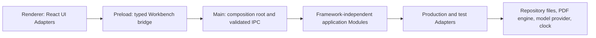

# V1 code map

Status: Tracer Bullets 1, 2, and 3 are complete and accepted; TB4 contextual workspace transfer is implemented and awaits user acceptance; later tracer bullets remain unimplemented.

This map tells agents where a Public Behavior enters the codebase, which Module owns it, which Adapter supplies external behavior, and which confirmed Test Seam observes it. Update it with live Markdown links in the same change that creates or moves code.

## Orient by behavior

1. Identify the current Tracer Bullet and confirmed Test Seam.
2. Find the owning Module below and enter through its public Interface.
3. Follow callers inward to the Implementation and outward to production and test Adapters.
4. Read the closest Behavior Test before changing the Interface.

Orientation is complete when the behavior's caller, owning Module, Adapter, and Test Seam are all accounted for. Search the repository when a listed pointer is stale; repair the map in the same change.

## Process and dependency direction

The renderer never imports main-process code or privileged Adapters. Preload exposes the bridge but owns no application rules. Application Modules import no Electron or React code. The main-process composition root chooses Adapters and wires Interfaces.

## Planned source roots

| Planned home | Responsibility | First expected use |
| --- | --- | --- |
| [`app/src/main/`](../../../app/src/main/) | Electron lifecycle, composition root, windows, validated IPC handlers | Tracer Bullet 1 |
| [`app/src/preload/`](../../../app/src/preload/) | Typed operation-specific Workbench bridge | Tracer Bullet 1 |
| [`app/src/renderer/`](../../../app/src/renderer/) | Shell and workspace UI Adapters | Tracer Bullet 1 |
| `app/src/modules/<module>/` | Framework-independent application Module; public Interface at its entry file | As the owning behavior appears |
| `app/src/adapters/<seam>/` | Production, In-memory, fixture, or Mock Adapters at real Seams | As the Seam appears |
| [`app/tests/workflows/`](../../../app/tests/workflows/) | S1 WebdriverIO desktop Behavior Tests | [`app/tests/workflows/open-empty-workbench.e2e.ts`](../../../app/tests/workflows/open-empty-workbench.e2e.ts), [`app/tests/workflows/create-knowledge-repository.e2e.ts`](../../../app/tests/workflows/create-knowledge-repository.e2e.ts), [`app/tests/workflows/create-knowledge-repository-in-empty-directory.e2e.ts`](../../../app/tests/workflows/create-knowledge-repository-in-empty-directory.e2e.ts), [`app/tests/workflows/open-valid-knowledge-repository.e2e.ts`](../../../app/tests/workflows/open-valid-knowledge-repository.e2e.ts), [`app/tests/workflows/reject-invalid-knowledge-repository.e2e.ts`](../../../app/tests/workflows/reject-invalid-knowledge-repository.e2e.ts), [`app/tests/workflows/cancel-knowledge-repository-selection.e2e.ts`](../../../app/tests/workflows/cancel-knowledge-repository-selection.e2e.ts), [`app/tests/workflows/preserve-selection-after-failed-replacement.e2e.ts`](../../../app/tests/workflows/preserve-selection-after-failed-replacement.e2e.ts), [`app/tests/workflows/reject-unavailable-knowledge-repository.e2e.ts`](../../../app/tests/workflows/reject-unavailable-knowledge-repository.e2e.ts), [`app/tests/workflows/reject-unsafe-knowledge-repository.e2e.ts`](../../../app/tests/workflows/reject-unsafe-knowledge-repository.e2e.ts), [`app/tests/workflows/reject-unsupported-knowledge-repository.e2e.ts`](../../../app/tests/workflows/reject-unsupported-knowledge-repository.e2e.ts), [`app/tests/workflows/open-newer-knowledge-repository-read-only.e2e.ts`](../../../app/tests/workflows/open-newer-knowledge-repository-read-only.e2e.ts), [`app/tests/workflows/carry-context-between-workspaces.e2e.ts`](../../../app/tests/workflows/carry-context-between-workspaces.e2e.ts) |
| [`app/tests/contracts/`](../../../app/tests/contracts/) | S5 shared Adapter and Module contract tests | [`app/tests/contracts/knowledge-repository.test.ts`](../../../app/tests/contracts/knowledge-repository.test.ts) |
| `app/tests/fixtures/` | Small fixed inputs with Independent Expected Values | Tracer Bullet 1 and TB2 open/rejection workflows |
| [`app/templates/knowledge-repository/`](../../../app/templates/knowledge-repository/) | Empty public starter skeleton for new repositories | [`starter-inventory.md`](starter-inventory.md) |

## Application Modules

| Module | Public responsibility | Test Seam | Planned public entry | Status |
| --- | --- | --- | --- | --- |
| [Workbench Session](architecture.md#workbench-session-module) | Open, create, or resume the Workbench, transition with context, and maintain the Working Set | S1 | [`app/src/modules/workbench-session/index.ts`](../../../app/src/modules/workbench-session/index.ts) | Fresh-session path, repository selection, access state, failure preservation, exact-root resume, remembered-root recovery, and TB4 in-session context transitions implemented; broader restorable context remains deferred |
| [Knowledge Authoring](architecture.md#knowledge-authoring-module) | Author Working Material while preserving rich/source semantic equivalence | S1 initially | `app/src/modules/knowledge-authoring/index.ts` | Unimplemented; Tracer Bullet 11 |
| [Governance](architecture.md#governance-module) | Draft Proposals, record Judgment, and apply eligible exact-version changes through file transactions | S2 | `app/src/modules/governance/index.ts` | Unimplemented; Tracer Bullet 8 |
| [Source Processing](architecture.md#source-processing-module) | Add PDFs with a chosen Source Asset mode, capture located annotations, report availability, relink, and request Synthesis | S3 | `app/src/modules/source-processing/index.ts` | Unimplemented; Tracer Bullet 5 |
| [Discovery](architecture.md#discovery-module) | Execute explicit Search, Ask, or Jump intentions with authority-aware outcomes | S4 | `app/src/modules/discovery/index.ts` | Unimplemented; Tracer Bullet 12 |
| [Learning](architecture.md#learning-module) | Keep learning goals human-owned and explain progress suggestions | S1 initially | `app/src/modules/learning/index.ts` | Unimplemented; Tracer Bullet 14 |

## UI Adapters and desktop bridge

| Adapter | Responsibility | Planned home | Status |
| --- | --- | --- | --- |
| Workbench shell | Window-level layout, global mode controls, accessible navigation, and workspace composition | [`app/src/renderer/`](../../../app/src/renderer/) | Fresh-session shell, TB2/TB3 repository selection and resume state, and TB4 workspace composition implemented; richer workspace behavior remains deferred |
| Atlas | Orientation, continuation, Judgment queue, Learning Routes, and actionable derived state | [`app/src/renderer/atlas/Atlas.tsx`](../../../app/src/renderer/atlas/Atlas.tsx) | Fresh empty state, repository selection/access status, failure feedback, resume state, and TB4 topic continuation implemented; later Atlas behavior remains unimplemented |
| Studio | Knowledge Authoring Interface and inspector presentation | [`app/src/renderer/studio/Studio.tsx`](../../../app/src/renderer/studio/Studio.tsx) | TB4 contextual topic presentation and Source Record transition implemented; authoring behavior remains unimplemented |
| Paper Desk | Source Processing Interface and PDF interaction presentation | [`app/src/renderer/paper-desk/PaperDesk.tsx`](../../../app/src/renderer/paper-desk/PaperDesk.tsx) | TB4 contextual Source Record presentation implemented; PDF interaction remains unimplemented |
| Workspace switcher | Compact global navigation among Atlas, Studio, and Paper Desk | [`app/src/renderer/workspace-switcher/WorkspaceSwitcher.tsx`](../../../app/src/renderer/workspace-switcher/WorkspaceSwitcher.tsx) | Implemented in TB4 for context-preserving in-session switching |
| Proposal Review | Governance Interface and exact-diff Judgment presentation | `app/src/renderer/proposal-review/` | Unimplemented |
| Workbench bridge | Narrow renderer-to-main desktop operations exposed through `contextBridge` | [`app/src/preload/workbench-bridge.ts`](../../../app/src/preload/workbench-bridge.ts) | Fresh session, repository create/open, and TB4 context-transition operations implemented |

## External Adapters

| Seam | Production Adapter | Test Adapter | Test Seam | Status |
| --- | --- | --- | --- | --- |
| Knowledge Repository | [`app/src/adapters/knowledge-repository/file-backed-knowledge-repository.ts`](../../../app/src/adapters/knowledge-repository/file-backed-knowledge-repository.ts) stages, validates, opens the bundled repository format, and reads the TB4 fixture context | [`app/src/adapters/knowledge-repository/in-memory-knowledge-repository.ts`](../../../app/src/adapters/knowledge-repository/in-memory-knowledge-repository.ts) | S5 contract; used by S1–S4 | File-backed creation, opening, safety validation, compatibility outcomes, context discovery, and contract coverage implemented through TB4 |
| Machine-local session state | [`app/src/adapters/session-state/file-backed-workbench-session-state.ts`](../../../app/src/adapters/session-state/file-backed-workbench-session-state.ts) stores the last explicitly selected repository root outside the portable format | Isolated session-state path supplied by the S1 workflow harness | S1 | Exact-root persistence and explicit unavailable/invalid remembered-root recovery are implemented in TB3; TB4 context is in-session only and broader restorable workspace context remains deferred |
| PDF | Deferred engine under `app/src/adapters/pdf/` | Deterministic fixture Adapter | S5 contract; used by S3 | Unimplemented; Tracer Bullet 5 |
| Model | OpenAI API Adapter under `app/src/adapters/model/`; absent configuration is an explicit unavailable outcome; other providers are future work | Narrow operation-specific Mock Adapters, including unavailable-provider behavior | Verified through S4, not an S5 equivalence contract | Unimplemented; Tracer Bullet 12 or later |
| Clock and identity | Platform clock and identifier sources under `app/src/adapters/system/` | Deterministic In-memory Adapters | Owning behavior's seam | Unimplemented until observable behavior requires them |

## Map maintenance

When code appears, replace each planned path with a relative Markdown link to the actual public entry. Add the closest production Adapter and Behavior Test without listing private helpers. Every production Module and Adapter must appear exactly once; generated files and framework boilerplate do not belong in this map.
